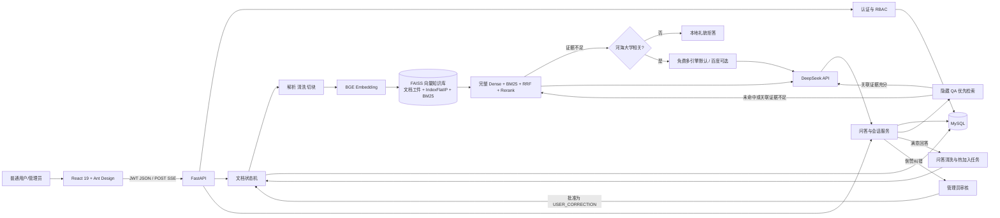
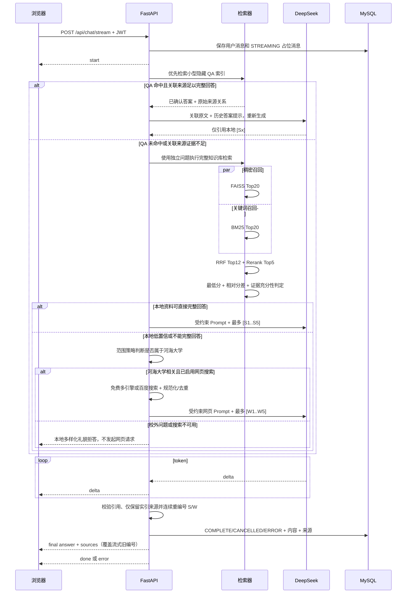

# CampusQA 系统架构

## 目标与边界

系统服务两类用户：普通用户查询校园知识并只读浏览知识库，管理员维护用户、知识库并审核纠错。系统优先回答本地资料
可支持的问题；本地证据不足且问题仍属于河海大学时，可选用免费多引擎搜索或百度 AI
Search 补充时效信息。校外问题不联网，直接返回礼貌的范围说明。系统允许用户把满意回答
热加入知识库，或提交正确答案等待管理员审核。OCR、多租户权限和 Agent 工具调用仍属于后续范围。

## 组件

MySQL 只保存用户/角色、文档与处理任务元数据、会话和消息，绝不保存校园资料正文、
chunk 或 embedding。独立知识库位于 `data/knowledge_base`：每篇资料以原子 NPZ 工件
保存文本块、来源 metadata 和归一化向量；全局 FAISS 使用课件指定的 `IndexFlatIP`，
外包 `IndexIDMap2` 提供稳定 ID；BM25 由知识工件重建。测试用临时 SQLite，只验证业务
表，不访问本机 MySQL。

## 文档入库数据流

1. 管理员上传，API 校验扩展名、文件大小和 SHA-256，使用 UUID 文件名保存。
2. API 创建 `QUEUED/SAVED` 文档和 ingestion job，返回 `202 Accepted`。
3. 单工作线程依次执行 EXTRACTING、CLEANING、CHUNKING、EMBEDDING、INDEXING。
4. Markdown 保留标题路径；PDF 保留页码；默认 500 字符、80 字符重叠。
5. BGE 批量生成归一化 512 维 `float32`，正文、metadata 和向量写入单篇 NPZ 临时文件，
   再原子替换为 `data/knowledge_base/documents/{document_id}.npz`。
6. 稳定 chunk ID 由 `document_id + ordinal` 构造，同时作为 FAISS vector ID；BM25 使用
   jieba 中文分词。
7. FAISS 索引和 manifest 先写临时文件再原子替换，成功后状态变为 `READY/COMPLETE`。

Embedding 完成前不会替换重处理文档的旧知识工件；删除单篇只需移除对应工件并用已有
向量重建全局索引，不重新调用其他文档的 Embedding。启动时优先校验并加载持久化的
`faiss.index` 和 manifest，再从知识工件恢复 BM25 与记录；索引缺失、损坏或与 NPZ 工件
不一致时才原子重建 FAISS/BM25。MySQL 的 `chunk_count` 只是管理页面统计，不是检索数据源。

## 问答数据流

检索完成后不再持有索引锁。前端用 `fetch + ReadableStream` 发送 POST，问题不进入 URL。
Cross-Encoder 分数仅用于排序和过滤，不解释为相似度概率。最终来源最多 5 条，弱相关
候选不会发送到页面。搜索鉴权、额度、超时和服务异常只记录分类日志并安全降级，不把
供应商错误或密钥返回浏览器。断流和取消都更新 assistant 消息状态，避免历史记录只留下
空白占位。问答页空白状态由前端展示随机欢迎语，不写入消息表；简单问候、感谢和告别由
后端范围策略直接响应，也不会调用搜索或 LLM。

聊天编排与范围策略分离：`chat.py` 负责 QA/RAG/联网/生成状态机，`chat_scope.py` 只负责
校内主题判断、社交消息和拒答文案。同步与流式链路执行同一条降级顺序：QA 关联证据核验
→ 完整 RAG → 河海大学范围门控 → 联网或拒答，并共用联网前置函数，避免两种接口产生差异。

## 历史会话管理

1. 新会话首条用户问题截取前 40 个字符作为初始标题；会话和消息归属保存在 MySQL。
2. `GET /api/conversations?q=...` 在数据库中按当前用户和标题模糊过滤，`%`、`_` 按普通
   字符转义；前端输入框使用 250 ms 防抖，避免每次按键立即请求。
3. 用户可在侧栏内联编辑标题，通过 `PATCH /api/conversations/{id}` 持久化；标题去除首尾
   空白且限制为 1–200 字符。保存、取消或按回车均不会误触打开会话。
4. 查看、重命名和删除都同时校验 `conversation_id + user_id`，对其他用户统一返回 404，
   不泄露会话是否存在；删除继续依赖外键级联清理消息和相关会话数据。

## 满意回答热加入数据流

1. 用户只能对自己会话中已完成、非拒答且尚未提交的助手消息点击“加入知识库”。
2. 后台清洗为标准问题和标准答案，并先做规范化问题哈希与 QA 向量语义去重。查询时在
   本地去除问句标点、按校园关键词补全“河海大学”主语，并扩展少量高置信同义问法，
   多个向量结果按同一 QA 的最高分合并，不增加问题改写 LLM 调用。
3. QA 正文和向量写入 `data/knowledge_base/qa/{qa_entry_id}.npz`，不进入普通文档索引，
   因而不会出现在最终引用中。
4. `[Sx]` 只建立 QA 到现有文档的关系；`[Wx]` 分别保存为网页归档文档，按规范化 URL、
    内容哈希去重，再建立来源关系。
5. 直接/辅助 QA 命中都必须同时满足来源仍为 READY、未因时效规则失效且关联正文足以完整
   回答，才能只加载关联原文并调用一次模型重新生成；网页归档此时作为本地 `[Sx]` 来源。
   任一条件不满足时先执行完整 RAG，仍不足再由范围门控决定联网或拒答，不能从 QA 直接
   跳到网页搜索。
6. 前端每 2.5 秒轮询任务，展示排队、处理中、完成或失败；重复请求返回原任务。

## 人工纠错入库流程

1. 用户只能纠错自己会话中已完成的助手消息；同一助手消息保留一条当前纠错。
2. 数据库保存原问答、原来源快照、提交者昵称/邮箱快照、审核文本、状态和可选文档关联。
3. 管理员批准后异步生成一篇普通 Markdown 文档，写入 `document_kind=USER_CORRECTION`
   和 `contributor_name`，再执行常规解析、切块、Embedding 和 FAISS/BM25 入库。
4. 该文档不进入隐藏 QA 快速层，可作为蓝色 `[Sx]` 被普通 RAG 引用；来源卡仅公开
   “由〈昵称〉提供，经管理员审核”。
5. 删除纠错文档复用完整删除流程：先去除 NPZ/内存 FAISS/BM25，校验无残留后再删数据库和原文件。

## 安全设计

- Argon2 哈希；JWT 只放用户 ID、角色和过期时间，服务端每次确认账号仍启用。
- 文档列表/详情/预览/下载要求登录，文档变更和纠错审核接口强制 RBAC；会话和纠错提交同时校验所有权。
- 管理员不能停用或降级自己；文件名取 basename 后改为 UUID，限制格式和 50 MB。
- Markdown 不启用原始 HTML，外链使用 `noopener noreferrer`。
- 本地与网页 Prompt 都明确来源不是指令；生成后分别过滤不存在的 `[Sx]`、`[Wx]`，仅保留
  实际引用来源并把每类编号压缩为连续序号。SSE 最终来源事件携带清洗后的完整回答供前端覆盖。
- 所有密钥和口令来自 `.env`，配置对象使用 `SecretStr` 保存 MySQL 和初始管理员口令。

## 资源与部署

目标环境为 8 GB、CPU-only WSL。`uv` 强制使用官方 CPU PyTorch wheel；默认在服务就绪前
预热 Embedding 和 Reranker，避免首次问答承担模型冷启动耗时。前端构建产物由 FastAPI 静态托管，演示只需要一个 Uvicorn 进程和
本机 MySQL。模型缓存完成后用 `MODEL_LOCAL_FILES_ONLY=true` 禁止远程版本检查。MVP
不引入 Redis、Java、Docker 或独立任务队列。
