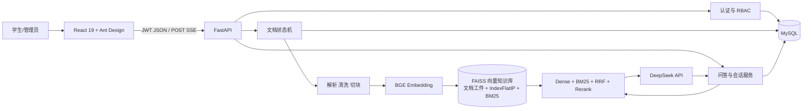
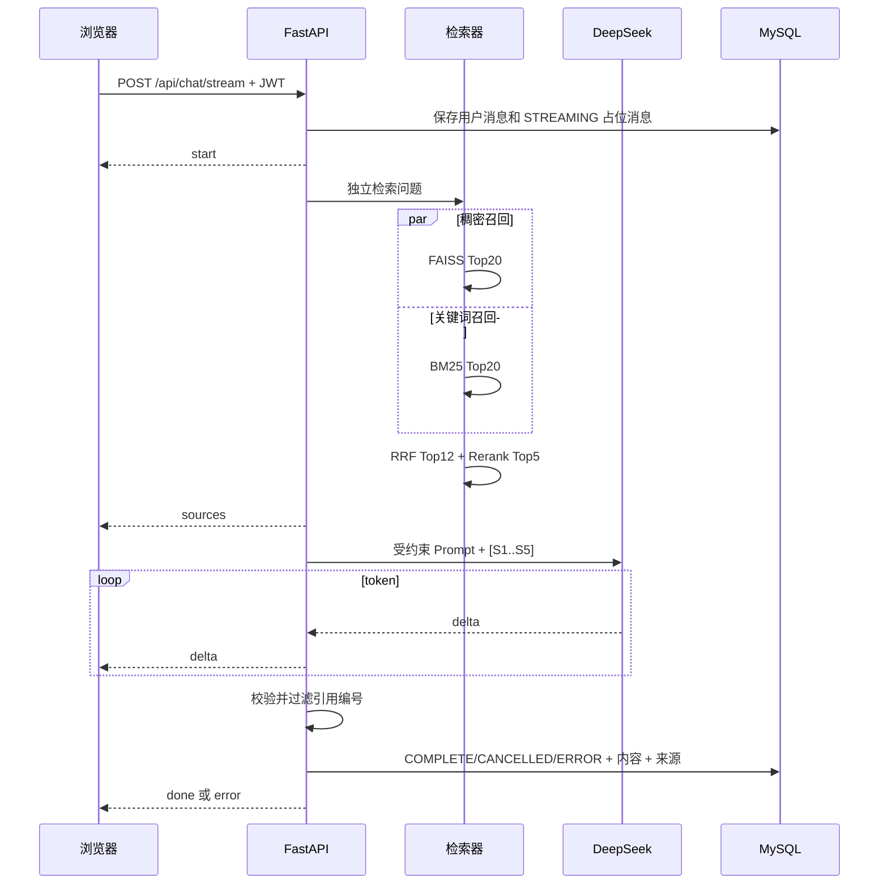

# CampusQA 系统架构

## 目标与边界

系统服务两类用户：学生查询校园知识，管理员维护用户和知识库。MVP 只回答本地资料可
支持的问题；OCR、在线官网搜索、多租户权限和 Agent 工具调用属于后续范围。

## 组件

MySQL 只保存用户/角色、文档与处理任务元数据、会话和消息，绝不保存校园资料正文、
chunk 或 embedding。独立知识库位于 `data/knowledge_base`：每篇资料以原子 NPZ 工件
保存文本块、来源 metadata 和归一化向量；全局 FAISS 使用课件指定的 `IndexFlatIP`，
外包 `IndexIDMap2` 提供稳定 ID；BM25 由知识工件重建。测试用临时 SQLite，只验证业务
表，不访问本机 MySQL。

## 文档入库数据流

1. 管理员上传，API 校验扩展名、文件大小和 SHA-256，使用 UUID 文件名保存。
2. API 创建 `QUEUED/SAVED` 文档和 ingestion job，返回 `202 Accepted`。
3. 单工作线程依次执行 EXTRACTING、CLEANING、CHUNKING、EMBEDDING、INDEXING。
4. Markdown 保留标题路径；PDF 保留页码；默认 500 字符、80 字符重叠。
5. BGE 批量生成归一化 512 维 `float32`，正文、metadata 和向量写入单篇 NPZ 临时文件，
   再原子替换为 `data/knowledge_base/documents/{document_id}.npz`。
6. 稳定 chunk ID 由 `document_id + ordinal` 构造，同时作为 FAISS vector ID；BM25 使用
   jieba 中文分词。
7. FAISS 索引和 manifest 先写临时文件再原子替换，成功后状态变为 `READY/COMPLETE`。

Embedding 完成前不会替换重处理文档的旧知识工件；删除单篇只需移除对应工件并用已有
向量重建全局索引，不重新调用其他文档的 Embedding。启动或 CLI 会从知识工件恢复
FAISS/BM25；MySQL 的 `chunk_count` 只是管理页面统计，不是检索数据源。

## 问答数据流

检索完成后不再持有索引锁。前端用 `fetch + ReadableStream` 发送 POST，问题不进入 URL。
断流和取消都更新 assistant 消息状态，避免历史记录只留下空白占位。

## 安全设计

- Argon2 哈希；JWT 只放用户 ID、角色和过期时间，服务端每次确认账号仍启用。
- 管理员接口强制 RBAC；会话查询同时限定 `conversation_id + user_id`。
- 管理员不能停用或降级自己；文件名取 basename 后改为 UUID，限制格式和 50 MB。
- Markdown 不启用原始 HTML，外链使用 `noopener noreferrer`。
- Prompt 明确资料不是指令；生成后过滤不存在的 `[Sx]`。
- 所有密钥和口令来自 `.env`，配置对象使用 `SecretStr` 保存 MySQL 和初始管理员口令。

## 资源与部署

目标环境为 8 GB、CPU-only WSL。`uv` 强制使用官方 CPU PyTorch wheel；Embedding 和
Reranker 延迟加载。前端构建产物由 FastAPI 静态托管，演示只需要一个 Uvicorn 进程和
本机 MySQL。模型缓存完成后用 `MODEL_LOCAL_FILES_ONLY=true` 禁止远程版本检查。MVP
不引入 Redis、Java、Docker 或独立任务队列。
